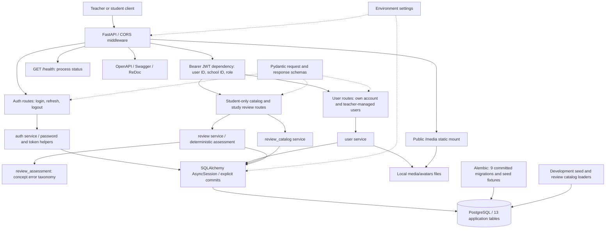
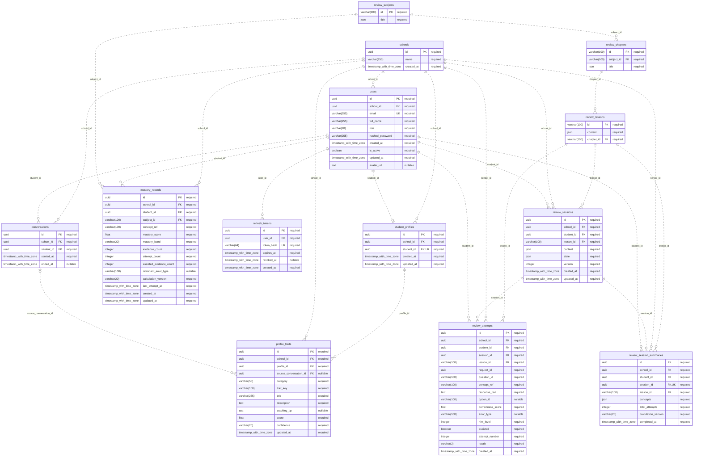
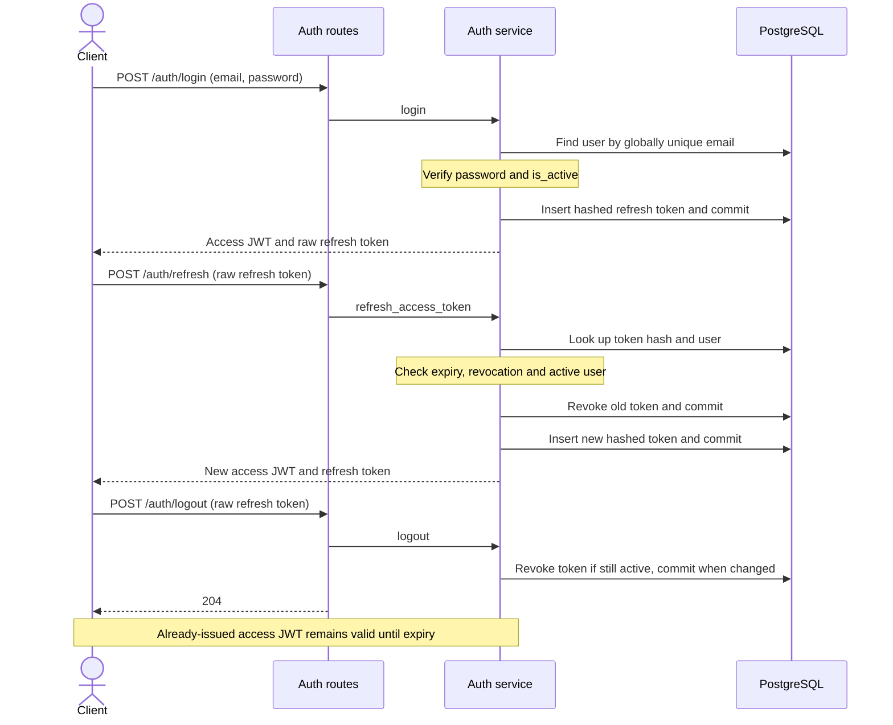
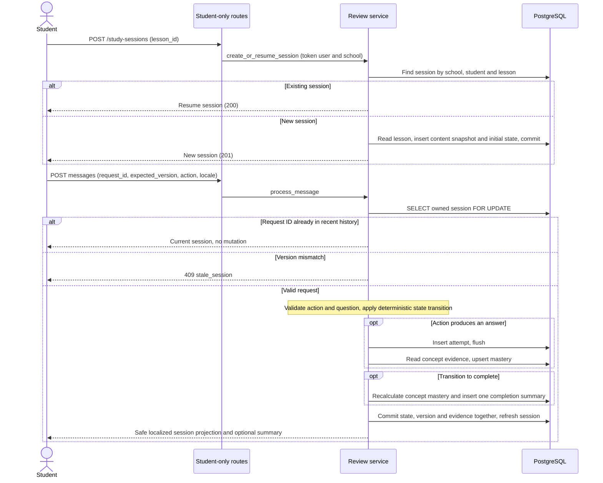

# Rafiqi backend: architecture and database

Generated from source commit `ad0717cefe31da9b797e1234d94f887a15fde07a` on 2026-09-25 (initial baseline: latest `main`).

Scope: **13 application tables, 99 columns, 25 foreign keys, 25 API operations, 9 migrations**. PostgreSQL 16 is the local Compose target.

## Files

- [Complete architecture assessment](architecture-review.md)
- [Rendered diagrams](rendered/README.md)
- [Complete database dictionary](database-layout.md)
- [PostgreSQL schema SQL](database-schema.sql)
- [Machine-readable schema](database-schema.json)
- [Implemented API inventory](api-layout.md)
- [JSON structures and behavior](json-and-behavior.md)

## Evidence and boundaries

The schema was reconstructed from migration declarations without running their data operations, then checked against SQLAlchemy models for tables, columns, types, nullability, foreign keys, unique constraints, checks and indexes. SQL is reference DDL; deploy with Alembic so catalog seed data and version history are applied. The Alembic-owned `alembic_version` bookkeeping table is not one of the 13 application tables. No live database was inspected or modified.

The checked-in generator can refresh these files with the backend Python environment: `python scripts/generate_backend_layout.py`. Diagrams describe implemented behavior, rather than future product-plan features. Each diagram is also supplied as editable `.mmd` source.

## Backend architecture

[Mermaid source](backend-architecture.mmd)

## Complete entity relationship diagram

[Mermaid source](database-erd.mmd)

## Authentication

[Mermaid source](authentication-flow.mmd)

## Review persistence flow

[Mermaid source](review-flow.mmd)

## Review state transitions

[Mermaid source](review-state.mmd)

```mermaid
stateDiagram-v2
    [*] --> AwaitingAnswer: create review
    AwaitingAnswer --> AwaitingAnswer: hint or help / assistance true
    AwaitingAnswer --> AwaitingAnswer: incorrect or partial answer / fewer than 3 attempts
    AwaitingAnswer --> Resolved: score equals 1 or third attempt
    Resolved --> Resolved: help
    Resolved --> AwaitingAnswer: next / more questions; reset question counters
    Resolved --> Complete: next / last question; save summary
    Complete --> Complete: help / summary remains unchanged
    note right of AwaitingAnswer
        chat maps to help or answer
        state is stored inside JSON
        invalid or stale actions return errors
    end note
```

## Migration history

[Mermaid source](migration-history.mmd)

```mermaid
flowchart LR
    m0["ef81a87bd4aa<br/>a1_initial_schema"]
    m1["b2c4f1a8e390<br/>a_user_add_is_active_updated_at"]
    m0 --> m1
    m2["c3d5f1a8b290<br/>a_user_add_avatar_url"]
    m1 --> m2
    m3["d4e6a2c9f1b7<br/>a_user_add_refresh_tokens"]
    m2 --> m3
    m4["e5a1b2c3d4e5<br/>review_companion"]
    m3 --> m4
    m5["f6b2c3d4e5f6<br/>review_catalog"]
    m4 --> m5
    m6["a7c3d4e5f6a7<br/>review_attempt_taxonomy"]
    m5 --> m6
    m7["6d9fe6080e14<br/>d4_add_mastery_records"]
    m6 --> m7
    m8["83bcb2215849<br/>d6_add_review_session_summaries"]
    m7 --> m8
```

